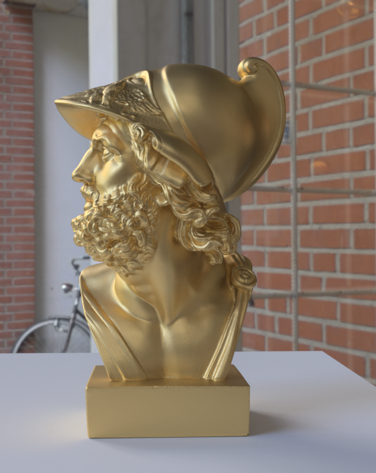
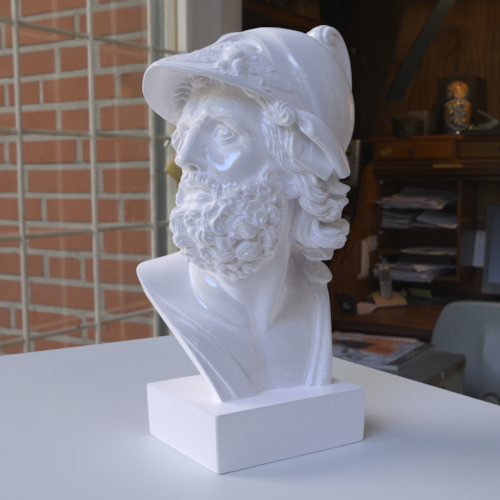
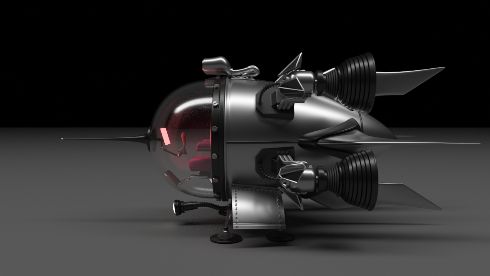
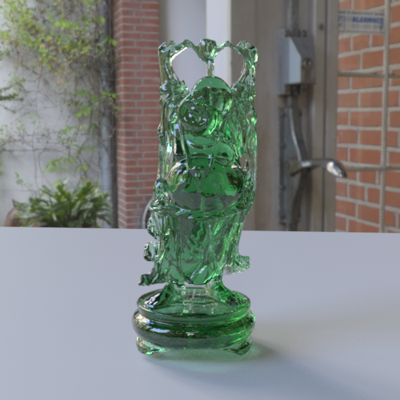
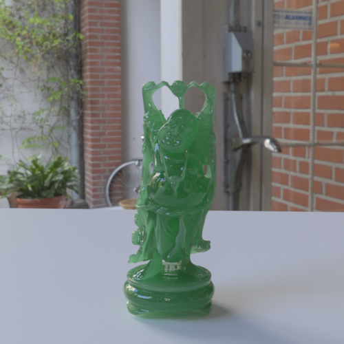
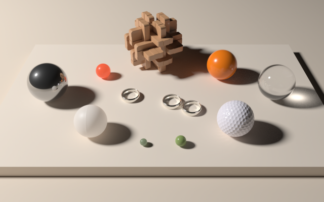
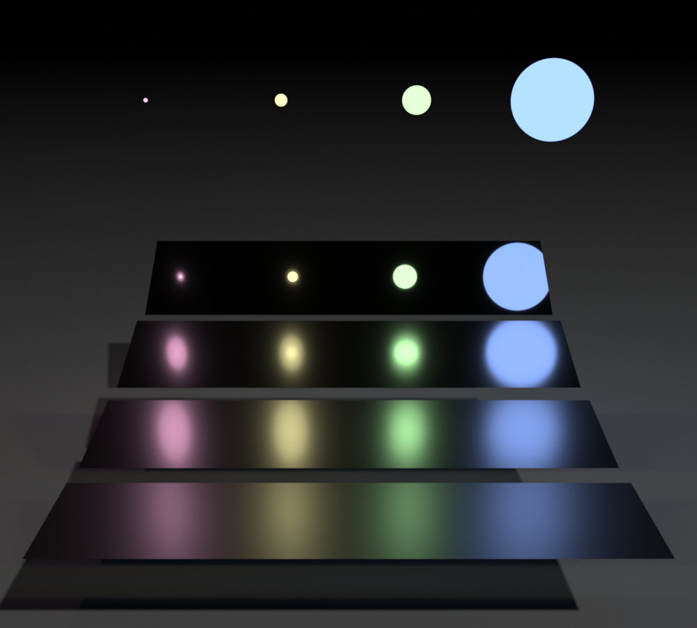

Tinsel
======

A lightweight CPU/GPU path tracer focusing on speed and simplicity. It offers a single flexible BSDF based on Disney's physically principled BRDF extended to specular transmission / subsurface scattering.

Features
--------

- Uni-directional forward path tracer
- BSDF based on Disney's BRDF with specular transmission / thin-shell subsurface scattering
- HDR environment light probes
- Multiple importance sampling of BSDF /  probes / area lights
- CPU or GPU tracing and shading
- Interactive OpenGL progressive mode
- Affine and deformable motion blur
- Gaussian and box reconstruction filters
- Instanced triangle mesh primitives
- AABB tree with SAH and various splitting heuristics
- Batch mode for animation rendering
- Simple scene description .tin format
- Windows / macOS / Linux support
- Wavefront tracing mode
- Non-Local Means noise filtering
- Tungsten scene loader

Images
------

Instancing test (palette courtesy of https://twitter.com/paniq)


Ajax bust in gold (courtesy http://forum.jotero.com)



Ajax bust in plaster (courtesy http://forum.jotero.com)



Spaceship model courtesy of Benedikt Bitterli (https://benedikt-bitterli.me/resources)



Coffee maker model courtesy of Benedikt Bitterli (https://benedikt-bitterli.me/resources/)


Glass Buddha with specular transmission (courtesy Stanford 3D Scanning Respository http://graphics.stanford.edu/data/3Dscanrep/)



Jade Buddha with sub-surface scattering (courtesy Stanford 3D Scanning Respository http://graphics.stanford.edu/data/3Dscanrep/)



Recreation of the Disney Hyperion test scene, https://www.disneyanimation.com/technology/innovations/hyperion.



Recreation of Eric Veach's multiple importance sampling test



Example Scene
-------------

The scene description in Tinsel is very simple, and loosely based off Arnold's .ass format,
here is an example:

```
# This is a comment

material gold
{
	color 1.0 0.71 0.29
	roughness 0.2
	metallic 1.0	
}

material plaster
{
	color 0.94 0.94 0.94
	roughness 0.5
	specular 0.1
}

material light
{
	emission 5.0 5.0 5.0
}

primitive
{
	type plane
	plane 0 1 0 0
	material plaster
}

primitive
{
	type sphere
	radius 0.5
	material light

	position 0.0 10.0 0.0
	rotation 0.0 0.0 0.0 1.0
	scale 1.0
}

primitive
{
	type mesh
	mesh octopus.obj
	material gold

	position 0.0 0.0 0.0
	rotation 0.0 0.0 0.0 1.0
	scale 2.0
}

```

Command Line
------------

Single Image:

```
tinsel -spp 100 scene.tin output.png
```

To convert an animation sequence, e.g.: frame_1.tin, frame_2.tin, ... use the following syntax:

```
tinsel -spp 100 frame_%d.tin
```


Todo List
---------

- [x] Multiple importance sampling
- [x] Mesh affine transformation support
- [ ] Disc primitive
- [x] Mesh sampling
- [ ] Multi material meshes or .obj conversion
- [x] SAH and median split BVH build heuristics
- [x] Clean up mesh allocations
- [x] Command line interface
- [x] Scene sky parameters
- [x] Scene camera parameters
- [x] Scene include files
- [x] Scene camera definition
- [x] Tone mapping
- [ ] Bloom filter
- [ ] Blackbody emitters
- [x] Output formats
- [x] Triangular noise dither
- [x] NLM noise filter
- [ ] Point sets primitive
- [x] Scene BVH
- [ ] FFmpeg encoding
- [x] Reconstruction filter
- [x] Correctness checks
- [ ] Volume rendering
- [x] Environment maps
- [ ] Lens modelling
- [x] Refraction
- [x] Examples

Supported Platforms
-------------------

Tinsel includes makefiles and Visual Studio projects for OSX and Windows respectively. Although not explicitly supported it should be relatively simple to build for Linux.

License
-------

Tinsel is licensed under the ZLib license, see LICENSE.txt.

Author
------

Miles Macklin - http://mmacklin.com
